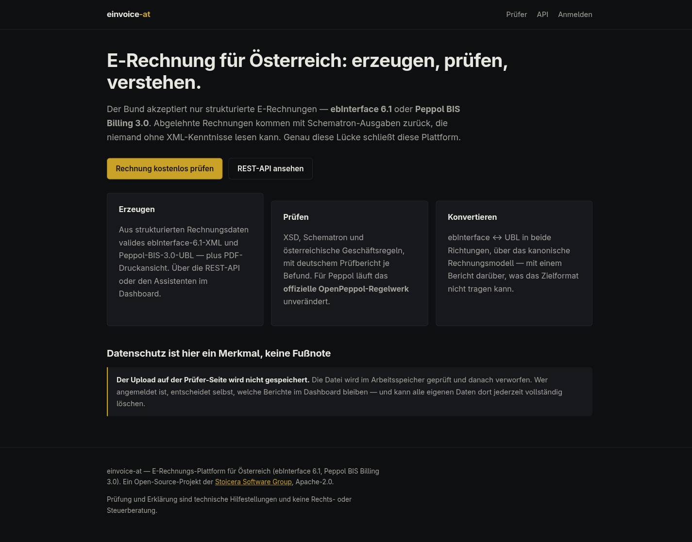
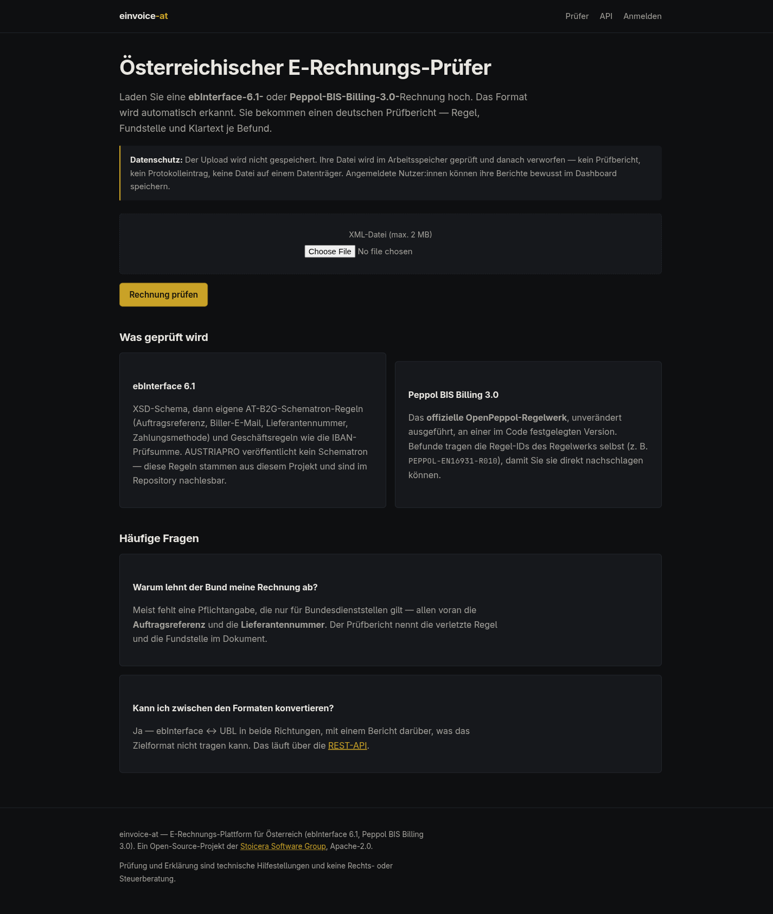
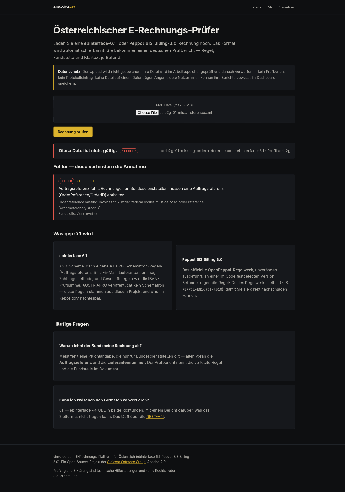
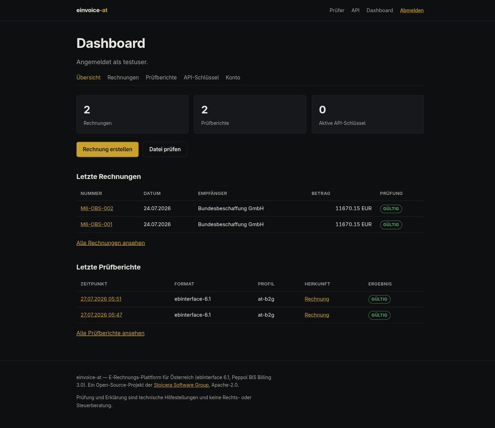
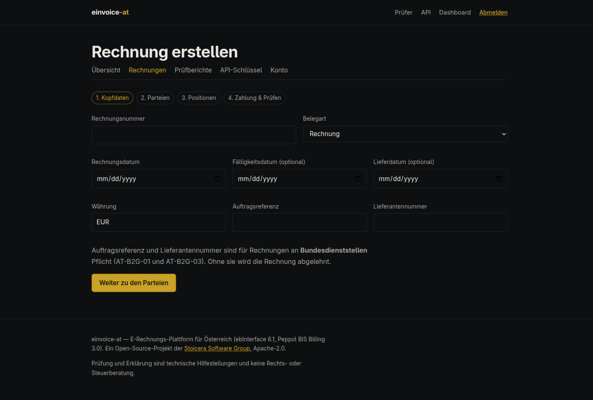
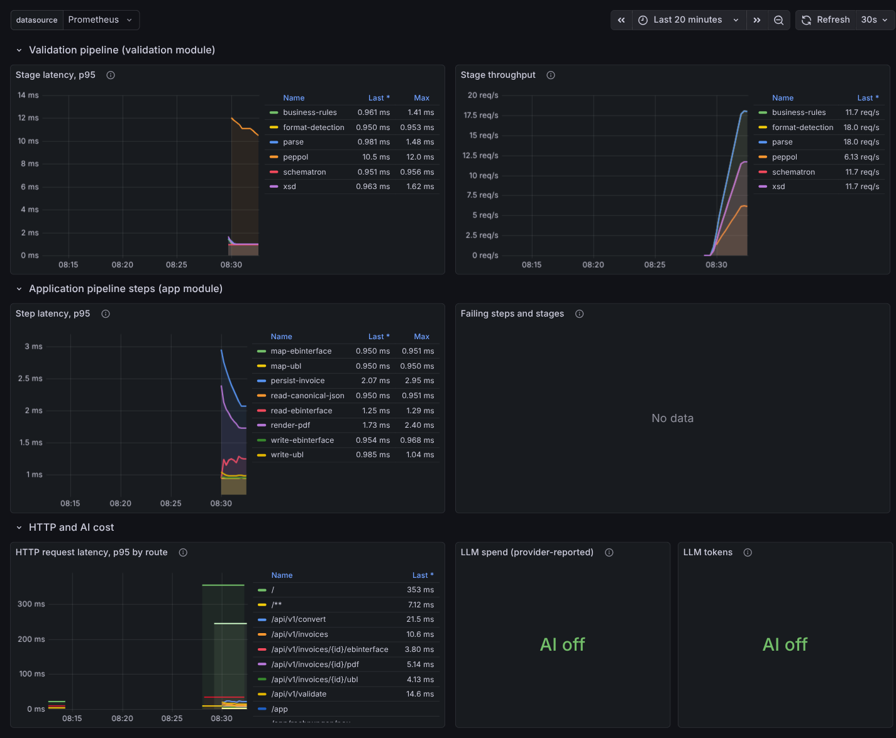
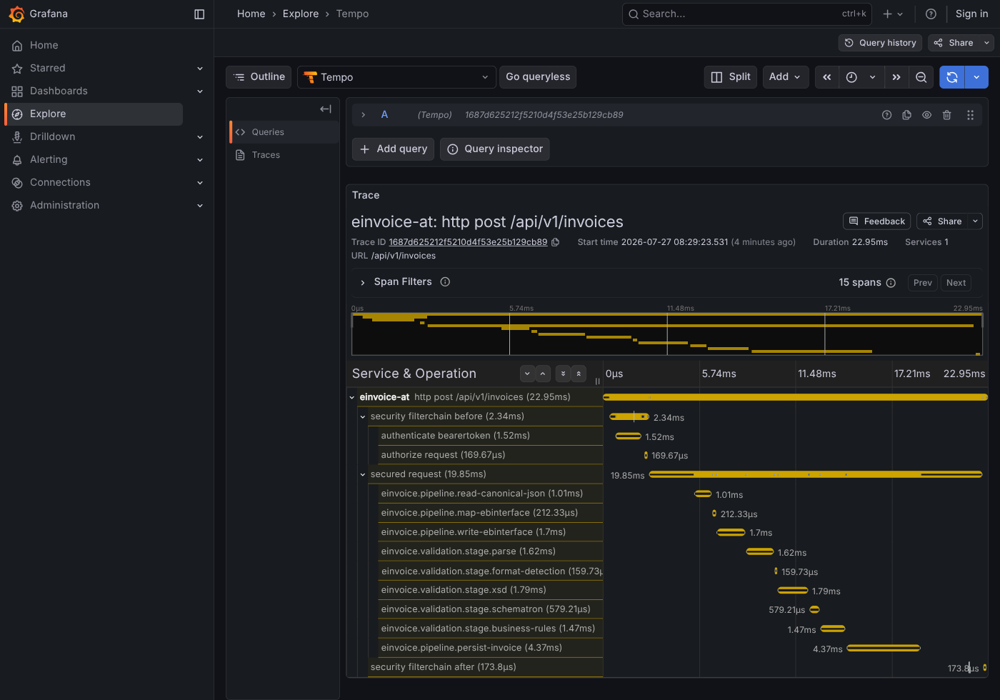

# einvoice-at

[](https://github.com/Stoicera/einvoice_at/actions/workflows/ci.yml)
[](LICENSE)

**Austrian e-invoicing platform: generate, validate and convert ebInterface 6.1 and Peppol BIS Billing 3.0 (UBL) — with human-readable German validation reports.**

A self-hostable Java 25 / Spring Boot platform built by [Stoicera Software Group](https://stoicera.com) as a production-grade reference system. Austria's federal government only accepts structured e-invoices (ebInterface or Peppol BIS) via e-rechnung.gv.at — and rejected invoices come back with Schematron output that non-technical users cannot read. This platform closes that gap.

> **Status: Milestone M6 complete — operations and polish.** On top of M5's browser surface, the
> platform is now **observable, deployable and documented for it**. **OpenTelemetry traces run across
> the pipeline stages** (ADR-0012): one trace of an invoice creation shows the JSON read, both
> mappings, the XML write, all five validation stages and the transactional persist, nested under the
> HTTP span — with traces and metrics both exported over OTLP and an `observability` compose profile
> (Prometheus + Tempo + Grafana, provisioned) to look at them. `/actuator/info` names the commit and
> the build time. There is a [deployment guide](docs/deployment.md) for Hetzner + Dokploy,
> **backup/restore scripts whose drill runs on every build**, and a [SECURITY.md](SECURITY.md) with a
> STRIDE-light threat model that names its own limits. Both public pages score **100 across all four
> Lighthouse categories**, asserted in CI. The two gaps M5 recorded by name are closed: the retention
> job now **elects a single purger** across instances, and a **real authorization-code login is driven
> through Keycloak's own form in a browser**. Milestone plan:
> [docs/MILESTONES.md](docs/MILESTONES.md); session-by-session detail: [docs/worklog.md](docs/worklog.md).

## Screenshots

Taken through a real browser against the running compose stack — the report is a genuine upload, the
dashboard is behind a genuine Keycloak login, and the observability captures are real traffic.

| | |
|---|---|
| [](docs/screenshots/01-landing.png)<br>**Landing** — German-first, SEO meta, no framework | [](docs/screenshots/02-validator.png)<br>**Public validator** — the upload is never stored |
| [](docs/screenshots/03-report.png)<br>**Report** — findings grouped by severity, German first, rule id and location per finding | [](docs/screenshots/04-dashboard.png)<br>**Dashboard** — per-tenant overview behind an OIDC login |
| [](docs/screenshots/05-wizard.png)<br>**Wizard** — four server-rendered steps, no JavaScript required | [](docs/screenshots/06-grafana-pipeline.png)<br>**Grafana** — stage and step latency, provisioned with the profile |

[](docs/screenshots/07-tempo-trace.png)

**One invoice creation, traced end to end.** This is what "OTel across the pipeline stages" means in
practice: `read-canonical-json` → `map-ebinterface` → `write-ebinterface` → `parse` →
`format-detection` → `xsd` → `schematron` → `business-rules` → `persist-invoice`, each timed, nested
under the HTTP span. The validation stages live in a module that must not know Spring exists, and
reach the tracer through a plain-Java port ([ADR-0012](docs/adr/0012-observability.md)).

## Deutsche Kurzfassung

**einvoice-at** ist eine selbst hostbare Plattform für die österreichische E-Rechnung: Sie **erzeugt** ebInterface 6.1 und Peppol BIS Billing 3.0 (UBL) aus strukturierten Rechnungsdaten, **validiert** hochgeladene XML-Rechnungen gegen XSD, Schematron und österreichische Geschäftsregeln — mit einem menschenlesbaren, deutschen Prüfbericht — und **konvertiert** zwischen beiden Formaten mit dokumentierten Mapping-Grenzen. Ein abschaltbarer KI-Assistent erklärt jeden Befund auf Wunsch in einfacher Sprache; personenbezogene Daten werden vorher maskiert und das geprüfte Dokument verlässt die Plattform nie ([docs/privacy.md](docs/privacy.md)). Angemeldete Nutzer:innen verwalten ihre Rechnungen, Prüfberichte und API-Schlüssel im Dashboard, erstellen Rechnungen über einen vierstufigen Assistenten und können ihr Konto samt aller Daten jederzeit vollständig löschen (Art. 17 DSGVO). Rechnungen werden dabei **nie** automatisch gelöscht — § 132 BAO verpflichtet Sie zu sieben Jahren Aufbewahrung ([ADR-0011](docs/adr/0011-retention-and-erasure.md)). Betrieb und Observability sind mit M6 fertig: OpenTelemetry-Traces über die Pipeline-Stufen, ein Compose-Profil zum Anschauen, ein Deployment-Leitfaden für Hetzner + Dokploy, Backup- und Restore-Skripte samt automatisierter Probe, und ein STRIDE-light-Bedrohungsmodell in [SECURITY.md](SECURITY.md). Aktueller Stand: **Milestone M6 abgeschlossen** — bis auf die Live-Instanz und das `v0.1.0`-Tag, die beide eine Maschine bzw. einen Knopfdruck brauchen.

## Architecture

Modular monolith, Maven multi-module; boundary rules are enforced by ArchUnit as each module gains code — the `core`-is-JDK-only rule is active since M1, and the cross-module rules (only `app` knows the database; `formats-*`/`mapping` never import Spring) landed with M3. See [ADR-0002](docs/adr/0002-modular-monolith.md).

```
einvoice-at
├── core                  canonical invoice model (EN 16931 core subset), pure Java, zero Spring
├── formats-ebinterface   ebInterface 6.1 read/write/validate (wraps ph-ebinterface)
├── formats-api           the format adapters' shared vocabulary (strategy contract, read result)
├── formats-ubl           Peppol BIS 3.0 / UBL 2.1 read/write (wraps ph-ubl)
├── mapping               canonical ↔ formats (both directions), conversion loss report, golden-file tested
├── validation            ebInterface: XSD + own AT-B2G Schematron + business rules; UBL: the official OpenPeppol rule set
├── rendering             invoice → German PDF print view (Apache PDFBox)
├── ai-assist             LlmClient port + OpenRouter adapter, PII scrubbing, feature-flagged, degradable
├── app                   Spring Boot app: REST API, web UI + dashboard, security, persistence, audit
└── e2e                   browser E2E (Selenium/Chrome) + the Gatling load scenario — see Testing
```

Every module is built and tested as of M6. `e2e` is compiled by every build but its tests run only
under `-Pe2e` / `-Pload`, in a dedicated CI job.

Stack: Java 25, Spring Boot 4.1, PostgreSQL 17 + Flyway, Thymeleaf (server-rendered, no CSS/JS build step — [ADR-0009](docs/adr/0009-web-ui.md)), Keycloak, Testcontainers. Rationale in [ADR-0001](docs/adr/0001-java-spring-boot-stack.md).

## Quickstart

Requires Docker with Compose.

```bash
git clone https://github.com/Stoicera/einvoice_at.git
cd einvoice_at
cp .env.example .env   # then set the required values: POSTGRES_PASSWORD, KEYCLOAK_ADMIN and
                       # KEYCLOAK_ADMIN_PASSWORD (generate the passwords, e.g. openssl rand -base64 24)
docker compose up -d   # starts postgres, keycloak (dev realm auto-imported), mailpit and the app
curl http://localhost:8080/actuator/health
# {"groups":["liveness","readiness"],"status":"UP"}
```

Then open **<http://localhost:8080/validator>** and drop an ebInterface or UBL invoice on it.
There are two ready to try in [`samples/`](samples/). Log in at **<http://localhost:8080/app>** with
`testuser` / `testpass` (the dev realm's only user) to see the dashboard.

Measured, not estimated: `docker compose up -d --build` to the first `"status":"UP"` took **82 s**
with no image present, and the image build alone takes **75 s** with `--no-cache` and an empty Maven
cache — i.e. downloading every dependency. Both are well inside M6's five-minute Quickstart budget;
the variable is your connection to Maven Central, not this repository.

**Want the traces?** One more flag and three more containers:

```bash
OTEL_ENABLED=true docker compose --profile observability up -d
# Grafana on http://localhost:3000 — datasources and the pipeline dashboard are provisioned
```

The profile decides which *services* start; it cannot set an environment variable on the app, which
is why `OTEL_ENABLED` is given explicitly. See [Observability](#observability).

## REST API

The `app` module serves the `/api/v1` REST API (M3). Interactive docs: **Swagger UI at
<http://localhost:8080/swagger-ui.html>** (OpenAPI JSON at `/v3/api-docs`).

| Method | Path | Auth | Purpose |
|---|---|---|---|
| `POST` | `/api/v1/validate` | public | Validate an uploaded ebInterface 6.1 **or** Peppol BIS 3.0 UBL document (multipart `file`, format auto-detected) → `ValidationReport`. Anonymous: nothing is persisted; authenticated: the report is persisted and audited. |
| `POST` | `/api/v1/invoices` | JWT or API key | Create an invoice from canonical JSON → `{id, report}` (201, `Location` header). |
| `GET` | `/api/v1/invoices` | JWT or API key | The tenant's invoices, newest first, paginated (`page`, `size`). |
| `GET` | `/api/v1/invoices/{id}` | JWT or API key | The stored canonical JSON. |
| `GET` | `/api/v1/invoices/{id}/ebinterface` | JWT or API key | The ebInterface 6.1 XML, regenerated on demand. |
| `GET` | `/api/v1/invoices/{id}/ubl` | JWT or API key | The Peppol BIS Billing 3.0 UBL XML (`ubl:Invoice` or `ubl:CreditNote`, decided by BT-3). |
| `GET` | `/api/v1/invoices/{id}/pdf` | JWT or API key | A German PDF print view, served inline. |
| `POST` | `/api/v1/convert?from=&to=` | JWT or API key | Convert between `ebinterface` and `ubl` (multipart `file`) → converted XML + loss report + validation of the result. |
| `GET` | `/api/v1/reports` | JWT or API key | The tenant's validation reports, paginated. |
| `GET` | `/api/v1/reports/{id}` | JWT or API key | One stored report, findings included. |
| `POST` | `/api/v1/reports/{id}/explain` | JWT or API key | Attach AI explanations to the report's findings, errors first — bounded per call, `?findingIndex=N` for exactly one. Nothing is persisted. `503` when the feature is off, and a *different* `503` when the provider produced nothing. |
| `DELETE` | `/api/v1/tenant` | **JWT only** | **Erase this tenant and everything it owns** (GDPR Art. 17): invoices, reports, API keys, audit events, the tenant row. Irreversible, no backup. An `X-Api-Key` is refused with `403`: a long-lived machine credential must not be able to trigger the most destructive operation here, least of all on invoices § 132 BAO obliges the business to keep for seven years ([ADR-0011](docs/adr/0011-retention-and-erasure.md) Entscheidung 6). Any API key of the erased tenant stops working, because its row goes too. |
| `POST` | `/api/v1/api-keys` | JWT only | Mint an API key; the plaintext is returned exactly once. |
| `GET` | `/api/v1/api-keys` | JWT only | The tenant's keys (active and revoked), without secrets. |
| `DELETE` | `/api/v1/api-keys/{id}` | JWT only | Revoke a key (soft: `revokedAt` stamped, row retained). |

**Auth modes.** Two mechanisms, exactly one per request: an OAuth2 **bearer JWT** from Keycloak
(`Authorization: Bearer <token>`) for interactive logins, or a tenant **API key**
(`X-Api-Key: eiv_…`) for machines. Presenting both is refused with 400 (RFC 6750 §3.1) rather than
letting filter order decide which tenant the request runs as. `POST /api/v1/validate` is public (no
credential). API-key management (`/api/v1/api-keys`) is JWT-only — an API key can neither mint nor
revoke keys. Full auth design and honest known limits:
[ADR-0006](docs/adr/0006-auth-and-api-security.md).

**Limits.** Request bodies are capped at 2 MB (`MAX_REQUEST_BODY_SIZE`) for multipart uploads and
plain bodies alike, both answering 413. Three buckets are rate-limited, with deliberately different
policies: anonymous `POST /validate` **per IP** (an authenticated caller is not the threat an open
endpoint's limit exists for), `POST /convert` **per credential, authenticated callers
included** — that endpoint admits no others, so an authenticated bypass would leave a limit
covering nobody, and a conversion costs a read, two mappings, a write *and* a full Peppol XSLT run —
and the **explain** routes (`POST /reports/{id}/explain` and the dashboard's per-finding button) on
that same per-credential policy, because they are the only routes whose cost is denominated in euros
rather than in CPU seconds. All answer 429 with `Retry-After`. A tenant holds at most 25 active API keys (`API_KEYS_MAX_ACTIVE_PER_TENANT`); revoked keys keep their rows
for the audit trail and do not count. `OAUTH2_AUDIENCE` optionally requires every token's `aud` to
name this API — off by default for the single-audience dev realm, recommended for any shared one.
`API_DOCS_ENABLED=false` removes the OpenAPI document and Swagger UI entirely.

**Response envelope.** `POST /invoices` and `POST /validate` both answer with a two-field envelope
`{"id", "report"}`: the persisted row's id (`null` for an anonymous `validate`, which persists
nothing) plus the `ValidationReport`.

**Errors.** Every error is RFC 9457 `application/problem+json`; each `type` is a stable URI under
`https://einvoice-at.stoicera.com/problems/`.

```bash
# 1. Fetch a dev access token from the compose Keycloak (dev-realm client, password grant).
#    Requires jq; the client id/secret and testuser are dev-only, shipped in keycloak/dev-realm.json.
TOKEN=$(curl -s \
  -d grant_type=password \
  -d client_id=einvoice-api \
  -d client_secret=dev-einvoice-api-secret-not-for-production \
  -d username=testuser -d password=testpass -d scope=openid \
  http://localhost:8081/realms/einvoice/protocol/openid-connect/token | jq -r .access_token)

# 2. Create an invoice from canonical JSON (JWT or X-Api-Key both work here).
curl -s -X POST http://localhost:8080/api/v1/invoices \
  -H "Authorization: Bearer $TOKEN" \
  -H "Content-Type: application/json" \
  --data-binary @invoice.json

# 3. Validate a document anonymously — no credential, nothing persisted.
curl -s -X POST http://localhost:8080/api/v1/validate \
  -F file=@invoice.xml

# 4. Fetch the regenerated ebInterface 6.1 XML for a stored invoice.
curl -s http://localhost:8080/api/v1/invoices/<id>/ebinterface \
  -H "Authorization: Bearer $TOKEN"

# 5. The same invoice as Peppol BIS Billing 3.0 UBL, and as a PDF you can open.
curl -s http://localhost:8080/api/v1/invoices/<id>/ubl \
  -H "Authorization: Bearer $TOKEN"
curl -s http://localhost:8080/api/v1/invoices/<id>/pdf \
  -H "Authorization: Bearer $TOKEN" -o rechnung.pdf

# 6. Convert an ebInterface document to UBL. The response carries the converted XML, a report of
#    everything UBL could not carry, and a validation of the RESULT against the official
#    OpenPeppol rules — so "can I send this?" is answered together with the document.
curl -s -X POST "http://localhost:8080/api/v1/convert?from=ebinterface&to=ubl" \
  -H "Authorization: Bearer $TOKEN" \
  -F file=@samples/invoice-b2g-sample.ebinterface.xml | jq '{conversion, findings: .report.findings}'
```

## Development

Requires JDK 25+ (build targets 25). Maven comes via the committed wrapper.

```bash
./mvnw verify                 # full build: Spotless check + unit + integration tests
./mvnw test -pl core          # fast domain feedback loop
./mvnw spotless:apply         # format before committing
docker compose up -d          # local stack (app, postgres, keycloak, mailpit)
```

`./mvnw verify` runs the `app` module's integration tests, which spin up PostgreSQL and Keycloak via
Testcontainers, so a running Docker daemon is required for the full build. `./mvnw test -pl core`
(and the other modules' unit tests) need no Docker.

Formatting is google-java-format, enforced by Spotless in every build and in CI.

**Security scan.** OWASP Dependency-Check runs as its own CI stage and gates on CVSS ≥ 7. It is a
Maven profile rather than part of `verify`, because keeping a local NVD copy current is minutes of
network I/O and would blow the build-time budget:

```bash
./mvnw -Psecurity verify        # needs NVD_API_KEY in the environment
```

**In this repository the scan is a live gate** — the `NVD_API_KEY` secret is configured, so CI runs
it for real and fails the build on CVSS ≥ 7. The two version overrides in the root POM are that
gate's own verdicts rather than precautionary bumps.

**Running it yourself, or in a fork:** the NVD rate-limits unauthenticated clients hard enough that a
first sync stalls, leaves its local database half-written and then fails with an unrelated-looking
error, so request a free key at <https://nvd.nist.gov/developers/request-an-api-key> and either
export it or add it as the repository secret `NVD_API_KEY`. Without it the CI job **skips the scan**
rather than running a doomed one — with a warning annotation and a job summary saying so in as many
words, because a stage that is permanently red for an external reason only teaches people to ignore
red. The job is not a no-op even then: it still asserts the scan binds exactly once, at the root.

## Testing

JUnit 5 + AssertJ + Mockito for unit tests, ArchUnit for module-boundary rules, Testcontainers for integration tests, **Selenium** for the browser flow and **Gatling** for the load scenario — built out milestone by milestone per [docs/ENGINEERING_STANDARDS.md](docs/ENGINEERING_STANDARDS.md).

**1080 tests** in a clean `./mvnw verify`, plus 5 browser E2E tests under `-Pe2e`.

**The `e2e` module, and what a green build does and does not mean.** Selenium and Gatling live in their own module because neither belongs on `app`'s test classpath, and because a Chrome image and a load profile do not belong in every developer's inner loop. Its tests are always *compiled* — a module whose tests are never built is a module that quietly stops compiling — but they only *run* under `-Pe2e` (browser) and `-Pload` (Gatling), in a dedicated CI job alongside the existing mutation and security jobs. Stated plainly rather than implied: **a green plain `./mvnw verify` does not mean the browser flow works; the `e2e` job is what means that.**

```bash
./mvnw -pl e2e verify -Pe2e                 # Upload → Report → Erklären in real Chrome
docker compose up -d                        # the load scenario needs a running application
./mvnw -pl e2e gatling:test -Pload          # public validator under concurrent upload
```

The browser suite covers what no HTTP assertion can: that the report fragment is really swapped into the page by the first-party script, that the explanation lands in the right per-finding container, that the landing page logs **no** severe console entry (which is how a missing favicon was caught), and that the validator still works with **JavaScript disabled** — ADR-0009's claim, asserted rather than asserted-in-prose. The Gatling scenario refuses to report a percentile measured through the rate limiter: it asserts no request was rejected, so a run against a default-configured instance fails instead of publishing a fast, meaningless number.

**Domain modules.** Every module carries a JaCoCo gate, and six of them a [PIT](https://pitest.org) mutation gate on top, so the coverage numbers have teeth rather than just line reach. Figures below are read off the JaCoCo CSV of a full `./mvnw verify`, not estimated:

| Module | Line | Branch | JaCoCo gate | PIT (mutations killed) |
|---|---|---|---|---|
| `core` | 99.6 % | 98.3 % | 95/90 | 98 % (126/129) |
| `mapping` | 99.2 % | 90.6 % | 95/90 | 99 % (411/417) |
| `validation` | 95.9 % | 90.0 % | 90/85 | 89 % (140/158) |
| `formats-ebinterface` | 100 % | 100 % | 90/85 | 100 % (12/12) |
| `formats-ubl` | 98.6 % | 96.3 % | 90/85 | 93 % (27/29) |
| `rendering` | 95.6 % | 88.8 % | 90/85 | — |
| `formats-api` | 100 % | 100 % | 100/100 | — |
| `ai-assist` | 97.0 % | 97.2 % | 90/85 | 90 % (99/110) |

`core` carries a [jqwik](https://jqwik.net) property suite for money/VAT arithmetic; `mapping` carries round-trip properties in both directions, including one that re-emits a read document and demands byte equality. `formats-api` gates at 100/100 — one record and one interface, where anything less would be a line nobody bothered to test.

**Round trips and golden files.** The two mapper pairs are exercised by jqwik round-trip properties over one shared input space, which is how the formats' asymmetries were established rather than assumed. `UblEndToEndGenerationTest` is the milestone's strongest automated claim: the sample invoice, generated through the real chain, is judged **Peppol-clean by the official OpenPeppol rule set** — an external verdict, not a self-assessment, since those rules are OpenPeppol's and this project only runs them.

**`app` module.** 95.0 % line / 81.4 % branch (JaCoCo gate 90/78, measured across unit *and* integration runs merged — most of this module's behaviour is only observable end to end). 110 unit tests and 209 integration tests across 33 IT classes, the latter against real PostgreSQL and real Keycloak via Testcontainers:

- **Auth matrix** (`AuthMatrixIT`) — both directions of every mechanism: anonymous, unknown key, revoked key, valid key, valid JWT, a bearer header that is not a JWT, an `alg=none` token, a genuine Keycloak token with a rewritten payload, and a request presenting two competing credentials.
- **Token validation** (`JwtDecoderTest`) — a throwaway JWKS over loopback and self-minted tokens, so wrong issuer, expired `exp`, a foreign signing key, and a foreign key impersonating the real `kid` can each be varied one at a time.
- **Tenant isolation** — for invoices, reports *and* API keys: one tenant can never read, revoke or list another's rows.
- **Transactional guarantees** (`ApiKeyServiceTransactionIT`) — a failing audit write rolls the key write back with it.
- **The browser surface** (`PublicWebIT`) — the forms are driven the way a browser drives them: fetch the page, harvest the session cookie and the `_csrf` token Thymeleaf injected, post both back. A token-less post is asserted to be **refused**, so the CSRF enforcement is proven rather than worked around. Also asserts the two filter chains still own their own paths, and that an anonymous upload leaves the `report` row count unchanged.
- **The AI flow, both ways** (`AiExplanationIT`) — upload → report → erklären against a real stub provider on a loopback port, with the request body read back to prove no IBAN, e-mail, VAT id or sampling parameter left the JVM; plus the outage path, the cache, and the cost/token meters. Its sibling assertions in `PublicWebIT` cover the flag-off half: no button, no client, nothing lost.
- **The dashboard** (`DashboardIT`, `ApiKeyPageIT`, `InvoiceWizardIT`) — every page asserted for tenant isolation per route, not once globally; the three document downloads asserted to be served **to a session** (an API link would 401, which is why they are `/app` routes); the freshly minted API key asserted to be shown once and **not** on reload; the wizard driven step by step through one session, with the draft asserted invisible to a second one.
- **GDPR erasure and retention** (`TenantDeletionIT`, `RetentionServiceIT`, `TenantErasureApiIT`) — erasure asserted table by table, including the audit trail and the tenant row, with the counterpart assertion that another tenant is untouched; the API key used for the call asserted to stop authenticating. The retention suite's load-bearing test is a *negative* one: a **ten-year-old invoice survives a purge**, because § 132 BAO obliges the business to keep it and a platform that swept it up would be actively harmful.
- **The browser-login wiring** (`OAuth2ClientWiringIT`) — an OAuth2 client configured with explicit, deliberately **unreachable** endpoints. The context starting at all is the assertion: it could not, if Spring Boot attempted OIDC discovery. That is not hypothetical — a provider `issuer-uri` in `docker-compose.yml` made the whole application fail to boot, public validator included, and nothing in the suite noticed because every other context configures no OAuth2 client ([ADR-0009](docs/adr/0009-web-ui.md) Entscheidung 6).
- **The rest** — Flyway migration and index assertions, repository round-trips through JSONB/`char`/`numeric` columns, rate limiting, request-body caps, security headers, the OpenAPI document and its off-switch, and the ArchUnit cross-module rules.

PIT is deliberately *not* applied to `app`: mutating a module whose tests each boot a Spring context and two containers costs minutes per mutant for little signal, and its genuinely algorithmic parts are covered by fast unit tests.

## Web UI

The browser surface is server-rendered Thymeleaf with **no CSS or JavaScript build step** — a
hand-authored stylesheet and ~20 lines of first-party script. Both are deliberate deviations from
SPEC §1's Tailwind CLI and htmx, and [ADR-0009](docs/adr/0009-web-ui.md) records why and what they
cost. **Every page works with JavaScript disabled**; the script only avoids a full page reload for the
two fragment swaps.

| Page | Auth | What it is |
|---|---|---|
| `GET /` | — | Landing page, German-first with SEO meta |
| `GET /validator` | — | The public "Österreichischer E-Rechnungs-Prüfer" (PRD §2's lead magnet) |
| `POST /validator/pruefen` | — | Upload → report fragment. Rate-limited, 2 MB cap, **nothing stored** |
| `POST /validator/erklaeren` | — | One finding → AI explanation fragment (only when the flag is on) |
| `GET /app` | Login | Dashboard overview: per-tenant counts and the most recent invoices and reports |
| `GET /app/rechnungen` | Login | Invoice list, paginated |
| `GET /app/rechnungen/{id}` | Login | One invoice: verdict, report history, canonical JSON, three downloads |
| `GET /app/rechnungen/{id}/{ebinterface,ubl,pdf}` | Login | The three documents, regenerated per request, served **to the session** |
| `GET /app/rechnungen/neu` | Login | Create-invoice wizard, four server-rendered steps |
| `GET /app/berichte` | Login | Stored report list — and it says which reports are *not* here, and why |
| `GET /app/berichte/{id}` | Login | Report detail, same fragment the public validator renders |
| `POST /app/berichte/{id}/erklaeren` | Login | Explain one stored finding **by position**, not by posted text |
| `GET /app/api-schluessel` | Login | Mint, list and revoke API keys; the plaintext is shown exactly once |
| `GET /app/konto` | Login | What is stored about you, and the danger zone that erases it |

**Two security filter chains, not one.** `/api/**` keeps M3/M4's policy byte for byte — stateless,
CSRF disabled, bearer token or `X-Api-Key`. The browser surface gets its own chain with a session,
**CSRF enforcement** (the ENGINEERING_STANDARDS §4 requirement that had nothing to protect while the
app was API-only) and `oauth2Login` against Keycloak. The chain order is load-bearing: an API path
placed outside `/api/**` would fall through to the browser chain and answer a login redirect instead of
a 401, so `PublicWebIT` asserts the split rather than trusting it.

**The public upload stores nothing, through the same code as the API.** It calls the *same*
`ReportService.validate(bytes, Optional.empty())` the anonymous REST endpoint calls, where the empty
`Optional` means "write nothing". A UI-specific validation path would have been a second place for
that promise to break; instead there is one, and an integration test asserts the `report` row count
does not move after an anonymous upload. The wizard applies the same principle to creation: its last
step serialises the draft to canonical JSON and calls the *same* `InvoiceService.create` that
`POST /api/v1/invoices` calls.

**The dashboard's downloads are `/app` routes, not links into `/api/v1` — and that is not an
oversight.** Linking a button to `/api/v1/invoices/{id}/pdf` is the obvious move and would not work:
`/api/**` is the stateless chain and never reads the browser's session cookie, so the click would land
on a 401 in a new tab. The dashboard serves the same `InvoiceService` output behind the session chain
instead. The service is the shared part; the transport is not, and cannot be.

**The browser login is wired without OIDC discovery.** A provider `issuer-uri` makes Spring Boot fetch
`.well-known/openid-configuration` at startup, and in Docker that URL is the browser-facing one — which
inside the container is its own loopback. Setting it made the entire application fail to boot. The four
endpoints are given explicitly instead, and Keycloak's `KC_HOSTNAME` is pinned so the `iss` claim is one
value on both channels. Both halves are pinned by tests; the reasoning and the cost are in
[ADR-0009](docs/adr/0009-web-ui.md) Entscheidung 6.

## AI explanations

Off by default. `FEATURES_AI_EXPLANATIONS=true` plus an `AI_API_KEY` turns on a "Fehler erklären"
button per finding, which returns two short German paragraphs: what the finding means, and the one
change that fixes it. Design and honest limits: [ADR-0010](docs/adr/0010-ai-assist.md); data flow:
[docs/privacy.md](docs/privacy.md).

Four properties worth stating, because each is enforced by a test rather than by intent:

- **The document is never sent.** Only the finding — rule id, severity, location, message. SPEC §6
  originally described sending ~40 lines of XML around the location; that is not built and *cannot* be
  without keeping uploads, which is the promise above. PII scrubbing is undiminished by this: a
  Schematron message quotes the offending document value verbatim, so IBAN / e-mail / VAT-id /
  long-number masking has real work to do on the finding text itself.
- **Nothing unmasked leaves the JVM.** `AiExplanationIT` runs the real flow against a stub provider on
  a loopback port and reads the bytes that were actually sent.
- **Switched off means no beans, not failing calls.** With the flag off there is no provider client in
  the context and no button on the page. With it on but the provider unreachable, the report renders
  unchanged and the button answers a friendly notice — `FindingExplainer.explain` never throws.
- **Cost comes from the provider, not from a price table.** `einvoice.ai.calls`,
  `einvoice.ai.tokens` and `einvoice.ai.cost.usd` are Micrometer counters fed by the provider's own
  reported charge; an unknown cost is left out rather than recorded as zero. Read them at
  `GET /actuator/metrics/einvoice.ai.cost.usd` (authenticated — only the health probes are
  anonymous). The `model` tag is bounded rather than taken verbatim: it comes out of the provider's
  response body, and an unbounded tag value is an unbounded number of meters.
- **A paid route has a rate limit, not just a per-request cap.** `AI_MAX_FINDINGS_PER_REQUEST`
  bounds one request; `RATE_LIMIT_EXPLAIN_*` bounds the rate. A retry after a provider 429 waits —
  honouring `Retry-After` when the provider sent one, exponentially otherwise, capped at 5 s.

## Conversion and PDF

Converting between the two formats runs **through the canonical model**, never syntax to syntax:
`source → canonical → target`. The canonical model derives and re-verifies every amount
([ADR-0003](docs/adr/0003-canonical-model.md)), so a conversion cannot silently change a total — and
whatever the model cannot represent shows up as a reported loss instead of disappearing.

Every conversion produces a **`ConversionReport`** alongside the document, German first:

| Code | Severity | Means |
|---|---|---|
| `CONV-01` | WARN | a value was **lost** — the target format has nowhere to put it |
| `CONV-02` | INFO | a national or format **convention** was translated |
| `CONV-03` | INFO | a value survived, but in a **different element** than the obvious one |
| `CONV-04` | **ERROR** | the source's own stated total **disagrees** with the one derived from its lines |

`isLossless()` and `isTrustworthy()` are deliberately different questions. Dropping a field the
target has no concept of is normal and leaves a usable document; a changed amount does not.
`CONV-04` is the only thing that makes a conversion untrustworthy — the derived value wins, and the
caller is told the document said something else.

The formats lose different things, which is exactly why the report is per document rather than a
paragraph here. A round trip through UBL returns line ids, exemption reason codes and electronic
addresses. A trip through ebInterface returns the exemption code too — the code and text share one
free-text `Comment`, but they are folded in with a structure the reverse mapper unfolds — while line
ids do not survive (ebInterface identifies a line by position) and electronic addresses cannot,
because the format has no element for a network address at all.

**Round trips are golden-file tested in both directions** (`CrossFormatRoundTripTest`). Every valid
ebInterface document in the corpus comes back **byte-for-byte identical** from a trip through UBL;
the UBL → ebInterface → UBL direction is asserted to lose exactly the endpoint identifiers and
nothing else. That test is also how the exemption-code recovery above came to exist: the M4 hostile
review found the cross-format round trip missing, and writing it immediately exposed a defect where
the comment grew by one category code on every conversion.

`POST /api/v1/convert` also **validates the result** and returns that report too. A converter that
hands back XML and lets the caller discover at an access point that it fails Peppol has done half a
job.

**PDF.** `GET /api/v1/invoices/{id}/pdf` renders a German A4 print view — sender and recipient
blocks, metadata, line items, the VAT breakdown as its own table (§ 11 UStG requires the tax per
rate, not just a total), totals, payment details. It renders the *canonical* invoice, so the PDF,
the ebInterface XML and the UBL XML are three views of one document and cannot disagree.
[ADR-0008](docs/adr/0008-pdf-rendering.md) covers the library choice and the deliberate limits (no
logo, no embedded XML — this is a print view, not a ZUGFeRD hybrid).

## Validation pipeline

`InvoiceValidator` (module `validation`) validates an uploaded document and returns a `ValidationReport` of German-first `Finding`s. It has **one entry point and two pipelines**, because the two standards are in genuinely different shape:

- **ebInterface 6.1** → XSD, then this project's own AT-B2G Schematron, then hand-written business rules. Three stages, because AUSTRIAPRO publishes no Schematron at all and the profile rules had to be written here ([ADR-0004](docs/adr/0004-validation-pipeline-and-xsd-messages.md)).
- **Peppol BIS Billing 3.0 (UBL)** → one stage running the **official OpenPeppol rule set**, executed unmodified through phive at a pinned version. That VES already contains XSD, the EN 16931 rules and the Peppol BIS rules in the right order; splitting it up would mean taking the published rule set apart. Findings carry the rule set's **own** assertion ids (`BR-01`, `PEPPOL-EN16931-R010`, `UBL-CR-412`), so a reader can look them up directly. The pinned version is **2025.11**, the set in force as M4 shipped; its successor 2026.5 becomes mandatory 2026-08-17, and the upgrade procedure is in [ADR-0007](docs/adr/0007-ubl-peppol-and-conversion.md).

The ebInterface pipeline is staged with hard gating — a document must clear one stage before the next runs, and each stage stops the pipeline when continuing would be meaningless:

0. **Size guard** — an upload over 20 MB is rejected as `XML-02` before a single byte is parsed: a defensive, module-level cap that protects the validator independently of any caller. This is separate from — and looser than — the stricter 2 MB application-layer cap SPEC §4 places in front of the HTTP endpoint (`POST /api/v1/validate`, live since M3).
1. **Secure parse** — `SecureXml` parses the upload with an XXE-hardened, namespace-aware `DocumentBuilderFactory` (`disallow-doctype-decl`, external entities/DTD off). Not well-formed XML or a bare `DOCTYPE` → `XML-01`, pipeline stops.
2. **Format detection** — the root namespace is resolved against known ebInterface versions. An unrecognised namespace → `FORMAT-01`; a recognised but unsupported version (e.g. ebInterface 6.0) → `FORMAT-02`. Either stops the pipeline.
3. **XSD** — the bundled ebInterface 6.1 validation-executor-set (`VID_EBI_61`) runs via [phive](https://github.com/phax/phive). This VES is **XSD-only** — AUSTRIAPRO publishes no Schematron for ebInterface — so schema violations become `XSD-01` findings, each genuinely bilingual (the stage validates the document twice, once per `Locale`, because the underlying Xerces diagnostic text is baked in at validation time; see [ADR-0004](docs/adr/0004-validation-pipeline-and-xsd-messages.md)). An XSD-invalid document stops the pipeline: Schematron and business rules assume a structurally valid tree.
4. **Own AT-B2G Schematron** — runs only once the document is XSD-valid. `AT-B2G-01` checks the Auftragsreferenz is present; `AT-B2G-03` checks the Biller carries a contact e-mail address (`Address/Email`); `AT-B2G-04` checks the Biller carries a Lieferantennummer (`InvoiceRecipientsBillerID`); `AT-B2G-05` checks a `PaymentMethod` (`UniversalBankTransaction` or `NoPayment`) is present — all four are required for invoices to Austrian federal bodies.
5. **Java business rule** — runs alongside Schematron gating. `AT-B2G-02` checks every `IBAN` present under the payment method against the core `Iban` mod-97 checksum (the XSD only bounds an IBAN's length). The finding never echoes the IBAN itself — only its 1-based position in the document.

Every rule id the pipeline can produce is centralised in `RuleIds` (module `validation`) — the single registry the corpus and the CLI both depend on (the corpus asserts against it, the CLI only prints it), so the id scheme (`PREFIX-NN`) stays uniform as new rules land:

| Rule id | Stage | Meaning |
|---|---|---|
| `XML-01` | secure parse | upload is not well-formed XML |
| `XML-02` | size guard | upload exceeds the 20 MB defensive input-size cap |
| `FORMAT-01` | format detection | namespace matches no supported format |
| `FORMAT-02` | format detection | recognised ebInterface, unsupported version |
| `XSD-01` | XSD | document violates the ebInterface 6.1 schema |
| `AT-B2G-01` | own Schematron | Auftragsreferenz missing |
| `AT-B2G-02` | Java business rule | an IBAN present fails the mod-97 checksum |
| `AT-B2G-03` | own Schematron | Biller e-mail address (`Address/Email`) missing |
| `AT-B2G-04` | own Schematron | Lieferantennummer (`InvoiceRecipientsBillerID`) missing |
| `AT-B2G-05` | own Schematron | no `PaymentMethod` (`UniversalBankTransaction` or `NoPayment`) present |

**Golden-file corpus.** [`validation/src/test/resources/corpus/`](validation/src/test/resources/corpus/) is the pipeline's executable specification: `valid/` documents must clear every stage cleanly, `invalid/` documents each isolate exactly one deliberate defect against one rule id. `CorpusTest` runs every file through the real validator; the corpus's own README documents the file-by-file provenance. A reported mapping/validation bug is always added here as a new failing golden file before it is fixed in code.

**CLI.** `ValidationRunner` runs the pipeline over one or more files or directories and prints a German-first report per file (English mirror per finding). Run it over the golden-file corpus:

```bash
./mvnw -q -pl validation -am compile exec:java -Dexec.args="validation/src/test/resources/corpus"
```

Exit codes: `0` every validated file is valid, `1` at least one is invalid, `2` a usage or I/O error occurred — including no arguments, a nonexistent path, or a resolved file list that came back empty (e.g. a mistyped corpus path with no `*.xml` files), so a CI gate reading only the exit code can never mistake "found nothing" for "all valid".

## Observability

Both signals — traces **and** metrics — are exported over **OTLP**, and there is deliberately no
`/actuator/prometheus`. One mechanism to configure, and no new surface needing a credential:
everything under `/actuator` except the health probes is authenticated, so a scrape endpoint would
have meant either a credential for Prometheus or a hole in that rule. Prometheus 3 ingests OTLP
directly. Full rationale and its trade-offs: [ADR-0012](docs/adr/0012-observability.md).

**Off by default, and that default is load-bearing.** Boot's own defaults for both exporters are
"enabled, pointing at `localhost:4318`", so leaving them alone would have every installation that
never asked for observability posting into a socket nobody is listening on. `OTEL_ENABLED` gates
both. What is *not* gated is the instrumentation itself: with observability off, an observation is a
few field writes and no span, so the code has one shape in every deployment and switching it on is a
configuration change rather than a different object graph.

| Signal | Where it comes from |
|---|---|
| `einvoice.validation.stage{stage=…}` | The `validation` module's stages — `parse`, `format-detection`, `xsd`, `schematron`, `business-rules`, `peppol` — reported through a plain-Java `ValidationObserver` port so that module never imports Spring |
| `einvoice.pipeline{step=…}` | The steps `app` orchestrates: canonical-JSON read, both mappings, both writers, the PDF renderer, the transactional persist, the paid LLM call |
| `einvoice.ai.calls` / `.tokens` / `.cost.usd` | The provider's own reported usage, never a local price table ([ADR-0010](docs/adr/0010-ai-assist.md)) |
| `http.server.requests` | Boot's own |

Tag values come from a fixed set — compile-time constants and an enum — because a tag fed from
anywhere else is an unbounded number of time series. Latency panels need percentile histograms to
exist at all: without them Micrometer publishes a single `+Inf` bucket and `histogram_quantile`
answers `NaN` forever, which is exactly what the first version of the dashboard showed.

Under `SPRING_PROFILES_ACTIVE=prod` the logs are ECS-shaped JSON carrying `traceId`/`spanId`, so a
log line links to its trace with no further configuration.

## Deployment

Target: a single Hetzner VPS via Dokploy, with Traefik terminating TLS. The full guide —
provisioning, the environment a production deployment must think about, Keycloak in production mode,
rolling back, and a post-deploy smoke test — is **[docs/deployment.md](docs/deployment.md)**.

CI publishes an image to GHCR on every push to `main` (`ghcr.io/stoicera/einvoice_at:sha-<commit>`,
which is the tag to pin) and triggers the Dokploy webhook. Both steps skip loudly when their secrets
are absent, so a fork does not inherit a red pipeline for a deployment it does not have. A CI check
proves the built image can identify itself, because the deployment guide tells an operator to pin the
`sha-` tag and confirm it with `/actuator/info`.

**Backups.** `scripts/backup.sh` takes a compressed custom-format dump, **verifies it is readable**
with `pg_restore --list` before reporting success, and writes a SHA-256 sidecar. `scripts/restore.sh`
checks that sidecar, prints the target database and refuses to run without an explicit confirmation.
The round trip is not only documented: `BackupRestoreDrillIT` performs it on **every build** — dump,
restore into a second database, and assert every table's row count, the Flyway history, and the
canonical JSON column's actual content. Row counts alone would pass on a restore that produced the
right number of empty rows.

**Behind a reverse proxy, set `SERVER_FORWARD_HEADERS_STRATEGY=native`.** Without it every anonymous
caller shares Traefik's address, so the per-IP rate limit on the public validator becomes one global
bucket. With it and *no* proxy, `X-Forwarded-For` is caller-supplied text and anyone can mint
unlimited buckets. There is no value that is right in both topologies, so the deployment states which
one it is — and both directions are covered by tests. Boot's other option, `framework`, is
deliberately **not** used: a proxy appends to `X-Forwarded-For`, so the rightmost entry is the only
trustworthy one, and Spring's `ForwardedHeaderFilter` reads the leftmost. `native` (Tomcat's
`RemoteIpValve`) walks the chain from the trustworthy end. [`docs/deployment.md` §4](docs/deployment.md)
has the diagram; a third test asserts that a prepended address buys no extra allowance.

## Security

[SECURITY.md](SECURITY.md) carries the vulnerability-disclosure policy and a STRIDE-light threat
model: one table per category, each row naming the control **and** the class or test that enforces
it, so a reader can check the claim rather than take it. It also collects the known limits in one
place — the rate limiter is per instance, an Art. 17 erasure takes the audit trail with it, and this
platform is not a Peppol Access Point.

## Standards artefacts & credits

XSD and Schematron handling for ebInterface and Peppol builds on the excellent open-source work of [Philip Helger](https://github.com/phax): [ph-ebinterface](https://github.com/phax/ph-ebinterface), [ph-ubl](https://github.com/phax/ph-ubl), [phive](https://github.com/phax/phive) and [phive-rules](https://github.com/phax/phive-rules) (Apache-2.0/MIT). PDF rendering uses [Apache PDFBox](https://pdfbox.apache.org/) (Apache-2.0).

ebInterface is a standard of [AUSTRIAPRO](https://www.austriapro.at/); Peppol BIS Billing 3.0 is maintained by [OpenPeppol](https://peppol.org/). The split in how the two are validated here is worth stating plainly: the **Peppol rule sets are OpenPeppol's own, executed unmodified** at a pinned version — this project runs them, it does not reimplement them. The **AT-B2G Schematron rules** (`validation/src/main/resources/schematron/`) are original to this repository, because ebInterface ships no official Schematron at all and there is no AUSTRIAPRO artefact to build them on.

## License

[Apache-2.0](LICENSE) © Stoicera Software Group — Raphael Lugmayr & Sebastian Kern GesbR
